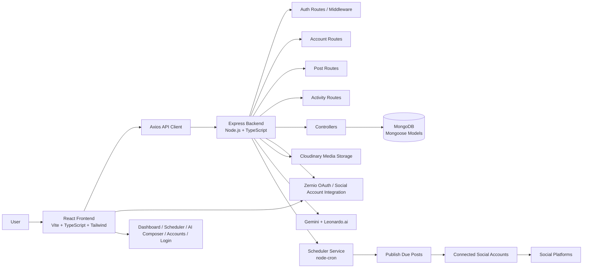

# Project Architecture and Workflow Interview Guide

## 1. Architecture Overview

This project is a full-stack social media automation platform that allows users to connect social accounts, generate AI-powered content, schedule posts, and publish them automatically across multiple platforms.

### High-Level Architecture

### Component Breakdown

1. Frontend Layer
   - React + TypeScript + Vite
   - Handles login, dashboard, accounts, AI content generation, and scheduling UI
   - Uses React Router for navigation
   - Uses AuthContext for user authentication state

2. Backend Layer
   - Express.js server with route-based API structure
   - Middleware handles authentication and request validation
   - Controllers manage the business logic

3. Database Layer
   - MongoDB stores users, posts, connected accounts, generated content, and activity logs
   - Mongoose models define the schema and validation rules

4. Integrations Layer
   - Zernio is used for OAuth and connected social accounts
   - Cloudinary stores uploaded media files
   - Gemini generates text content and image prompts
   - Leonardo.ai generates AI images

5. Automation Layer
   - node-cron checks scheduled posts every minute
   - When a post is due, the backend finds connected accounts and publishes it

---

## 2. Interview Answer: "Explain me project architecture"

“My project is a full-stack social media scheduling and automation platform. On the frontend, I built a React + TypeScript application using Vite and Tailwind CSS. It contains pages for login, dashboard, accounts, scheduler, and AI composer. The frontend communicates with the backend through REST APIs using Axios.

The backend is built with Node.js and Express. It exposes routes for authentication, social account management, posts, and activity tracking. These routes call controller functions that handle the main business logic. The backend also includes middleware for authentication, error handling, and secure access control.

For persistence, I use MongoDB with Mongoose models for users, accounts, posts, generations, and activity logs. The app also integrates with external services such as Zernio for OAuth-based social account connection, Cloudinary for media storage, Gemini for AI-generated content, and Leonardo.ai for AI image generation.

The scheduling system is built using node-cron. A cron job runs periodically and checks for posts whose scheduled time has arrived. If the post is due, the backend picks the connected accounts for the selected platforms and publishes the content automatically. This is the core automation component of the project.

So in short, the architecture is a decoupled system where the React frontend handles the UI, the Express backend handles business logic and integrations, MongoDB stores the data, and background cron jobs automate the publishing workflow.”

---

## 3. Interview Answer: "Explain me your whole workflow"

“My workflow starts with user authentication. A user signs up or logs in, and the frontend stores the JWT and user info in localStorage. The backend validates the token through middleware before allowing access to protected routes.

After login, the user can connect their social media accounts through OAuth. The app creates or reuses a profile with Zernio and then fetches connected accounts. These are saved in MongoDB so the user can later schedule content to specific platforms such as Instagram, LinkedIn, Facebook, or Twitter.

The next step is content generation. In the AI Composer page, the user enters a prompt and selects tone. The backend uses Gemini to generate social media content and an image prompt. If the user enables AI image generation, the app sends a request to Leonardo.ai to create an image, uploads it to Cloudinary, and stores the final media URL.

Once content is generated, the user selects the target platforms, enters date and time, and schedules the post. The backend saves the post record with status like scheduled, along with content, media URL, and scheduled time.

Then the scheduler service runs in the background with node-cron. Every minute, it checks for scheduled posts whose time has passed. For each due post, it finds the connected accounts matching the selected platforms, prepares the payload, and calls the relevant publishing API through Zernio. If publishing succeeds, the post status changes to published and an activity log is created. If it fails, the status is marked failed and logged for review.

Finally, users can view upcoming and published posts on the dashboard or scheduler page, while activity logs help them track what was published and what failed. So the complete workflow is: login → connect accounts → generate content → schedule post → background automation → publish to platforms → track state and logs.”

---

## 4. Short Interview Version

### Architecture
“My project has a React frontend connected to an Express backend, with MongoDB as the database. The backend exposes APIs for authentication, accounts, posts, and activity. It also integrates with Zernio for social account OAuth, Cloudinary for media uploads, Gemini for AI content generation, Leonardo.ai for images, and node-cron for scheduling and publishing.”

### Workflow
“The user logs in, connects social accounts, creates content using AI, schedules the post, and the backend saves it. A background cron job checks scheduled posts and publishes them automatically when their time arrives. The app then updates the post status and stores activity logs for transparency.”

---

## 5. Important Points to Mention in Interview

- Frontend and backend are separated clearly
- JWT-based authentication is used
- MongoDB stores all core data
- External APIs are integrated for social and AI features
- Cron job handles automation
- Cloudinary is used for media storage
- The project is designed as a social media SaaS workflow

This answer is concise, complete, and strong enough for a technical interview.
